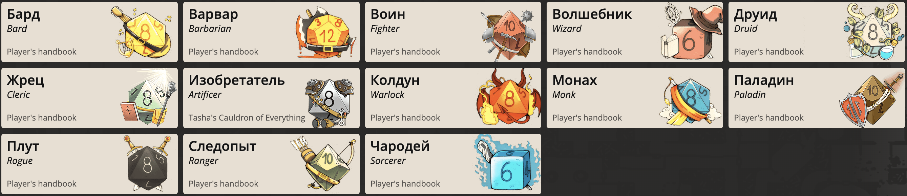
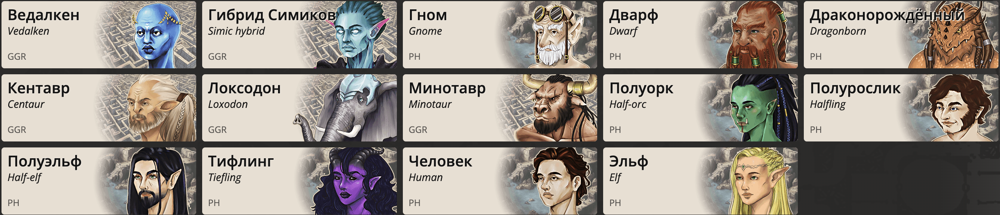

# Icuna World

Эта GitHub страница существует для сохранения лора моей D&D вселенной.
Здесь вы можете найти лор стран, существующие в сеттинге расы, да и всё пожалуй...

### Карта мира
В репозитории есть файл Icuna.map, его вы можете открыть с помощью сайта https://azgaar.github.io/.

Так-же прилагаю карту мира в виде изображения:

### Доступные классы

### Доступные расы

### Самые популярные расы в странах

| Мелетикос       | Аалет     | Эхтирам          | Вильестарк | Скалли   | Тесутто  |
|-----------------|-----------|------------------|------------|----------|----------|
| Ведалкены       | Дварфы    | Драконорожденные | Минотавры  | Все расы | Все расы |
| Гибриды Симиков | Гномы     | Полурослики      | Полуорки   |          |          |
| Эльфы           | Локсодоны | Полуэльфы        | Кентавры   |          |          |
| Люди            | Тифлинги  | Люди             | Тифлинги   |          |          |

### Лор стран

- [Мелетикос](./countries/Meleticos.md)
- [Аалет](./countries/Aaleth.md)
- [Вильестарк](./countries/Viljesturk.md)
- [Тесутто](./countries/Tesuttho.md)
- [Эхтирам](./countries/Ekhtiram.md)
- [Скалли](./countries/Skully.md)